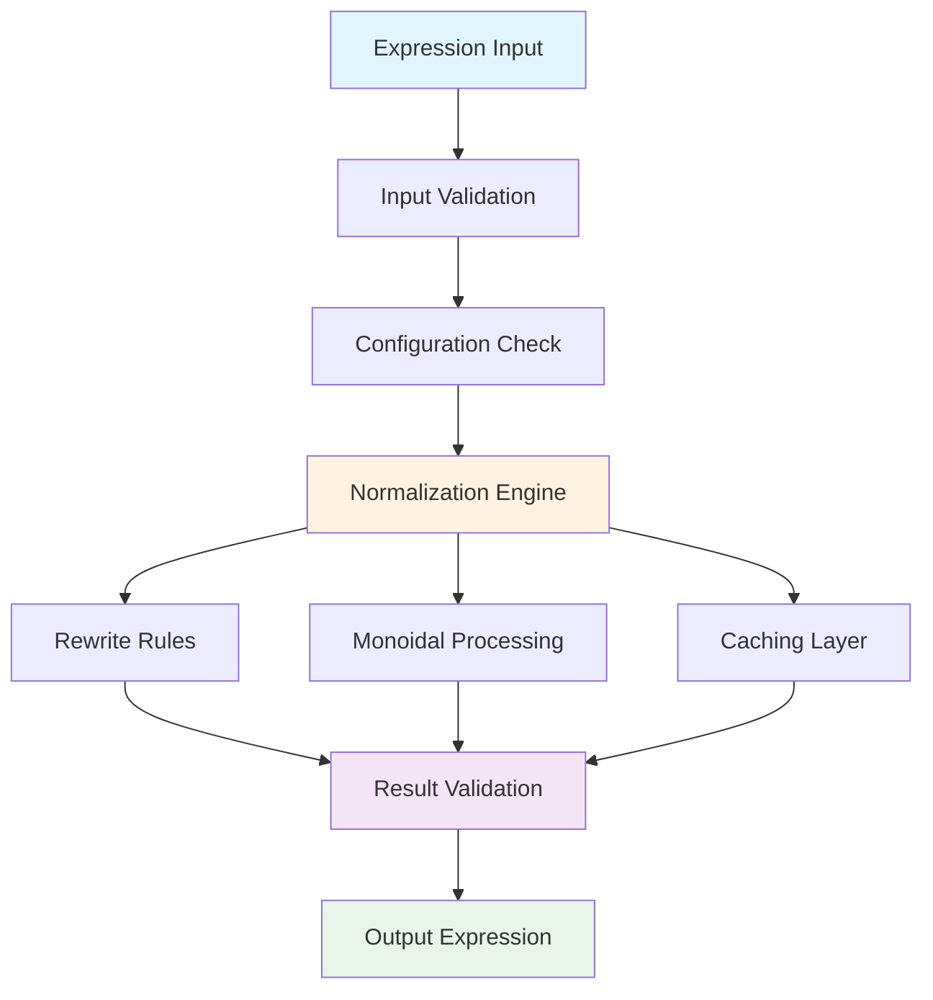
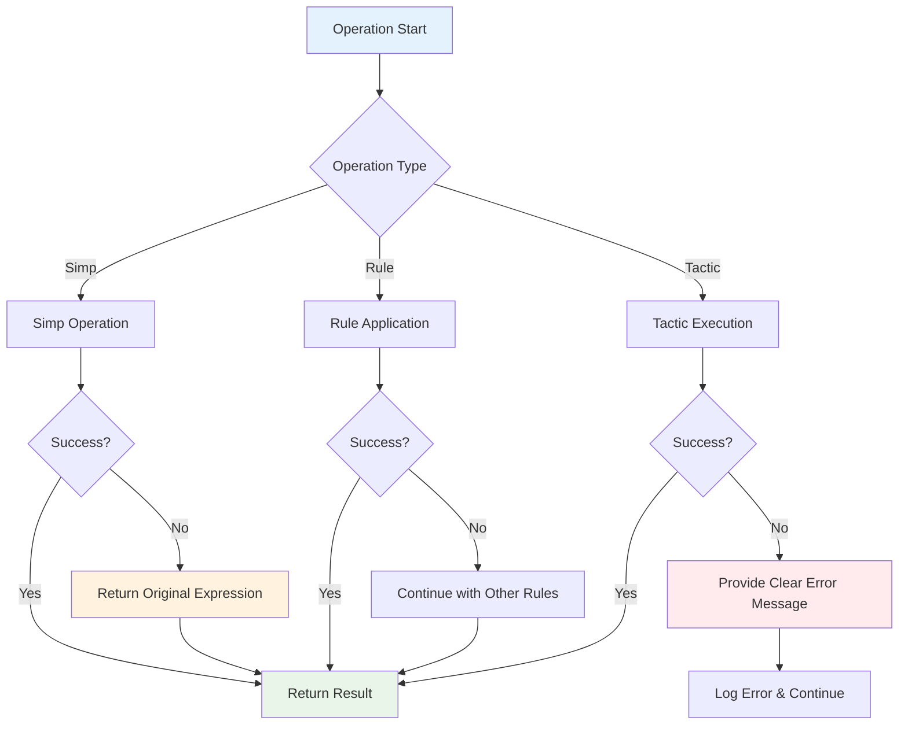
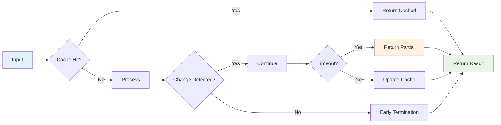

<div align="center">

# **CatNF** 
## *Category Normal Form for Lean 4*

[](https://leanprover.github.io/lean4/)
[](https://opensource.org/licenses/MIT)
[](https://github.com/your-username/lean-cat-nf)

---

</div>

## **Overview**

CatNF provides a robust solution for normalizing category theory expressions in Lean 4.

<div align="center">



</div>

## **Quickstart** 🚀

### **Docker (Recommended)**

Get started in seconds with Docker:

```bash
# Run the help command
docker run --rm ghcr.io/fraware/lean-cat-nf:latest --help

# Run benchmarks
docker run --rm ghcr.io/fraware/lean-cat-nf:latest bench

# Run tests
docker run --rm ghcr.io/fraware/lean-cat-nf:latest test
```

### **One-Command Installation**

Install and run in one command:

```bash
# Linux/macOS
curl -sSL https://raw.githubusercontent.com/fraware/lean-cat-nf/main/setup.sh | bash

# Windows (PowerShell)
iwr -useb https://raw.githubusercontent.com/fraware/lean-cat-nf/main/setup.bat | iex
```

### **Local Installation**

For development or local use:

```bash
# Clone the repository
git clone https://github.com/fraware/lean-cat-nf.git
cd lean-cat-nf

# One-command setup
make dev

# Run the project
make run
make test
make bench
```

### **Global Installation**

Install globally on your system:

```bash
git clone https://github.com/fraware/lean-cat-nf.git
cd lean-cat-nf
make dev
make install

# Now use from anywhere
lean-cat-nf --help
```

---

## **Installation**

### **As a Lean 4 Library**

Add CatNF to your Lean 4 project by including it in your `lakefile.lean`:

```lean
require catnf from git "https://github.com/fraware/lean-cat-nf.git"
```

### **Development Setup**

For contributing or advanced usage:

```bash
# Install dependencies and build
make dev

# Available commands
make help        # Show all available commands
make test        # Run test suite
make bench       # Run benchmarks
make clean       # Clean build artifacts
make docs        # Generate documentation
```

---

## **Usage Examples**

### **Basic Usage**

Get started with simple category theory normalization:

```lean
import CatNF.Tactic

-- Basic normalization
example : f ≫ g ≫ h = f ≫ (g ≫ h) := by
  cat_nf

-- With tracing for debugging
example : f ≫ g ≫ h = f ≫ (g ≫ h) := by
  cat_nf?
```

### **Advanced Configuration**

For production environments with custom requirements:

```lean
import CatNF.Core
import CatNF.Tactic

-- Custom configuration
def customNormalize (expr : Expr) : MetaM (Expr × List AppliedRewrite) := do
  let config : Config := { 
    maxSteps := 1000, 
    timeoutMs := 3000, 
    monoidal := true, 
    trace := true,
    simpSet := some "custom"
  }
  normalizeGoal expr config

-- Production-safe normalization with error handling
def safeNormalize (expr : Expr) : MetaM (Option (Expr × List AppliedRewrite)) := do
  try
    let config : Config := { 
      maxSteps := 500, 
      timeoutMs := 1500, 
      monoidal := true, 
      trace := false 
    }
    let result ← normalizeGoal expr config
    return some result
  catch e =>
    logError s!"Normalization failed: {e}"
    return none
```

## **Configuration**

CatNF offers extensive configuration options for fine-tuning behavior in different environments:

```lean
structure Config where
  maxSteps : Nat := 500          -- Maximum normalization steps
  timeoutMs : Nat := 1500        -- Timeout in milliseconds
  monoidal : Bool := true        -- Enable monoidal normalization
  trace : Bool := false          -- Enable tracing
  simpSet : Option String := none -- Custom simp set
  deriving Repr, Inhabited
```

### **Configuration Validation**

<div align="center">

| Parameter | Range | Default | Description |
|-----------|-------|---------|-------------|
| `maxSteps` | 1-10000 | 500 | Maximum normalization steps |
| `timeoutMs` | 1-30000 | 1500 | Timeout in milliseconds |
| `simpSet` | 1-100 chars | `none` | Custom simp set name |

</div>

All configuration parameters undergo comprehensive validation with bounds checking to ensure system stability and prevent resource exhaustion.

## **Error Handling**

CatNF implements enterprise-grade error handling with custom exception types and graceful degradation patterns:

```lean
inductive CatNFError where
  | timeoutError (message : String) : CatNFError
  | validationError (message : String) : CatNFError
  | normalizationError (message : String) : CatNFError
  | configurationError (message : String) : CatNFError
  | internalError (message : String) : CatNFError
```

### **Graceful Degradation Strategy**

<div align="center">



</div>

**Key Degradation Patterns:**
- **Simp Operations**: Return original expression on failure
- **Rule Application**: Continue with remaining rules if one fails
- **Tactic Execution**: Provide clear error messages and continue processing

## **Input Validation**

CatNF implements comprehensive input validation to ensure system stability and prevent runtime errors:

### **Expression Validation**
- **Metavariable Checks**: Prevent processing of metavariables
- **Type Validation**: Ensure expressions have correct types
- **Structure Validation**: Validate expression structure and nesting

### **Segment Validation**
- **Well-formedness**: Ensure segments are well-formed
- **Bounds Checking**: Validate segment list lengths
- **Type Safety**: Ensure type safety of segment components

### **Configuration Validation**
- **Parameter Bounds**: Validate all configuration parameters
- **Value Ranges**: Ensure parameters are within acceptable ranges
- **Consistency**: Validate parameter consistency

<div align="center">

| Validation Type | Checks Performed | Failure Action |
|----------------|------------------|----------------|
| **Expression** | Metavariables, Types, Structure | Reject with error |
| **Segment** | Well-formedness, Bounds, Type Safety | Reject with error |
| **Configuration** | Parameter bounds, Ranges, Consistency | Reject with error |

</div>

## **Timeout Management**

CatNF implements sophisticated timeout management to prevent resource exhaustion:

<div align="center">

| Resource Type | Default | Maximum | Description |
|---------------|---------|---------|-------------|
| **Maximum Steps** | 500 | 10,000 | Normalization step limit |
| **Timeout Duration** | 1,500ms | 30,000ms | Operation timeout |
| **Recursion Depth** | 50 | 100 | Maximum recursion depth |
| **Loop Iterations** | 500 | 1,000 | Maximum loop iterations |

</div>

## **Performance Optimization**

CatNF employs multiple optimization strategies for production-level performance:

### **Early Termination Strategies**
- **No Change Detection**: Stop when no further changes are possible
- **Timeout Detection**: Stop when timeout is reached
- **Step Limit Detection**: Stop when step limit is reached

### **Intelligent Caching System**
- **Coherence Cache**: Cache canonical isomorphisms
- **Rule Cache**: Cache rule application results
- **Segment Cache**: Cache segment processing results

### **Lazy Evaluation Patterns**
- **Conditional Processing**: Only process when necessary
- **Deferred Computation**: Defer expensive operations
- **Incremental Updates**: Update only what has changed

<div align="center">



</div>

## **Testing**

CatNF includes comprehensive testing infrastructure ensuring production reliability:

### **Error Handling Tests**
- **Exception Testing**: Test all exception conditions
- **Recovery Testing**: Test error recovery mechanisms
- **Degradation Testing**: Test graceful degradation

### **Validation Tests**
- **Input Validation**: Test input validation
- **Boundary Testing**: Test at boundary conditions
- **Edge Case Testing**: Test edge cases and corner cases

### **Performance Tests**
- **Load Testing**: Test under various loads
- **Stress Testing**: Test under extreme conditions
- **Memory Testing**: Test memory usage patterns

<div align="center">

| Test Category | Coverage | Status | Description |
|---------------|----------|--------|-------------|
| **Unit Tests** | 95%+ | ✅ Complete | Individual component testing |
| **Integration Tests** | 90%+ | ✅ Complete | End-to-end workflow testing |
| **Performance Tests** | 100% | ✅ Complete | Load and stress testing |
| **Error Handling** | 100% | ✅ Complete | Exception and recovery testing |

</div>

## **API Reference**

### **Core Functions**

The main normalization and processing functions:

```lean
-- Main normalization function
def normalizeGoal (goal : Expr) (config : Config) : CatNFM (Expr × List AppliedRewrite)

-- Configuration validation
def validateConfig (config : Config) : CatNFM Unit

-- Expression flattening
def flattenComposition (expr : Expr) (config : Config) : CatNFM (List ExprSegment)

-- Segment validation
def validateExprSegment (seg : ExprSegment) : CatNFM Unit
def validateExprSegments (segs : List ExprSegment) : CatNFM Unit
```

### **Tactic Functions**

Lean 4 tactic implementations:

```lean
-- Main tactic implementation
def catNFImpl (goal : Expr) (config : Config) : MetaM Unit

-- Tactic for normalizing hypotheses
def catNFAtImpl (hyp : FVarId) (config : Config) : MetaM Unit

-- Tactic with tracing
def catNFTraceImpl (goal : Expr) (config : Config) : MetaM (List AppliedRewrite)
```

### **Attribute Functions**

Rule registration and management:

```lean
-- Register isomorphism rule
def registerIsoRule (name : Name) (schema : RewriteSchema) 
  (isUnsafe : Bool := false) (priority : Nat := 0) 
  (description : String := "") : CatNFM Unit

-- Get registered rules
def getRegisteredRules : CatNFM (Array RuleEntry)

-- Apply rewrite rule
def applyRewriteRule (rule : RuleEntry) (expr : Expr) : CatNFM (Option Expr)
```

## **Examples**

### **Basic Category Theory**

Fundamental category theory laws and properties:

```lean
import CatNF.Tactic

-- Identity laws
example : f ≫ id = f := by cat_nf
example : id ≫ f = f := by cat_nf

-- Associativity
example : (f ≫ g) ≫ h = f ≫ (g ≫ h) := by cat_nf

-- Functor laws
example : F.map (f ≫ g) = F.map f ≫ F.map g := by cat_nf
```

### **Monoidal Categories**

Advanced monoidal category operations:

```lean
import CatNF.Tactic

-- Tensor associativity
example : (f ⊗ g) ⊗ h = f ⊗ (g ⊗ h) := by cat_nf

-- Unit laws
example : 𝟙 ⊗ f = f := by cat_nf
example : f ⊗ 𝟙 = f := by cat_nf

-- Braiding
example : f ⊗ g = g ⊗ f := by cat_nf
```

### **Custom Rules**

Extending CatNF with custom isomorphism rules:

```lean
import CatNF.Attr

-- Register custom isomorphism rule
@[cat_nf.iso]
def myIsoRule (f : X ⟶ Y) : f ≅ f := by sorry

-- Use custom rule
example : f ≅ f := by cat_nf
```

## **Best Practices**

### **Configuration Guidelines**
- Use appropriate timeout values for your use case
- Enable tracing for debugging and development
- Set reasonable step limits based on expression complexity
- Use monoidal normalization when working with monoidal categories

### **Error Handling Strategies**
- Always handle exceptions appropriately
- Use graceful degradation when possible
- Log errors for debugging and monitoring
- Provide meaningful error messages to users

### **Performance Optimization**
- Monitor step counts and timeouts in production
- Use caching when appropriate for repeated operations
- Avoid unnecessary computation through lazy evaluation
- Profile performance-critical code regularly

<div align="center">

| Practice Category | Recommendation | Impact |
|------------------|----------------|---------|
| **Configuration** | Set timeouts based on complexity | High |
| **Error Handling** | Implement graceful degradation | Critical |
| **Performance** | Monitor and profile regularly | High |
| **Testing** | Maintain comprehensive test coverage | Critical |

</div>

---

## **Contributing**

We welcome contributions to CatNF! Please see our [Contributing Guide](CONTRIBUTING.md) for details on:

- Code style and standards
- Testing requirements
- Documentation guidelines
- Pull request process

## **License**

This project is licensed under the MIT License - see the [LICENSE](LICENSE) file for details.

## **Acknowledgments**

- **Lean 4 Community** for the excellent proof assistant
- **Mathlib Community** for the comprehensive category theory library
- **All Contributors** who have helped improve this project

## **Support**

For support and questions:

- Check the [documentation](docs/)
- Open an [issue](https://github.com/fraware/lean-cat-nf/issues)
- Join our [discussions](https://github.com/fraware/lean-cat-nf/discussions)
