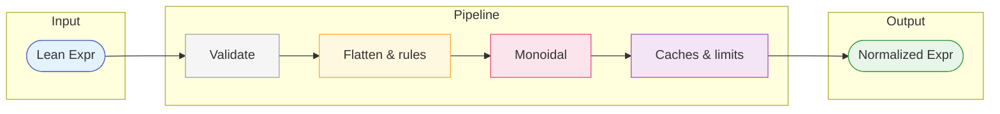

<div align="center">

<pre>
##############################################################################################
#                                                                                            #
#                                  ____      _     _   _ _____                               #
#                                 / ___|__ _| |_  | \ | |  ___|                              #
#                                | |   / _` | __| |  \| | |_                                 #
#                                | |__| (_| | |_  | |\  |  _|                                #
#                                 \____\__,_|\__| |_| \_|_|                                  #
#                                                                                            #                               
##############################################################################################
</pre>

### Category normal form for Lean 4

Normalize category-theoretic morphism expressions inside Lean’s metaprogramming layer—composition, identities, functorial maps, monoidal structure, and more—behind a configurable, validated pipeline.

<br/>

[](https://leanprover.github.io/lean4/)
[](LICENSE)
[](.github/workflows/ci.yml)

<br/>

[Contributing](CONTRIBUTING.md) · [Documentation](docs/README.md) · [User guide](docs/UserGuide.md) · [Canonical forms](docs/WhatCountsAsCanonical.md) · [Versions](docs/Compatibility.md) · [Issues](https://github.com/fraware/lean-cat-nf/issues)

</div>

---

## Overview

CatNF validates configuration, flattens and rewrites morphism structure (composition, functors, monoidal pieces, and related rules), and returns a normalized `Expr` plus optional trace data.


```mermaid
flowchart LR
  subgraph in["Input"]
    E(["Lean Expr"])
  end
  subgraph pipe["Pipeline"]
    V[Validate]
    N[Flatten & rules]
    M[Monoidal]
    C[Caches & limits]
  end
  subgraph out["Output"]
    R(["Normalized Expr"])
  end
  E --> V --> N --> M --> C --> R
  style E fill:#e3f2fd,stroke:#5c6bc0
  style R fill:#e8f5e9,stroke:#43a047
  style V fill:#f5f5f5,stroke:#9e9e9e
  style N fill:#fff8e1,stroke:#ffa726
  style M fill:#fce4ec,stroke:#ec407a
  style C fill:#f3e5f5,stroke:#ab47bc
```

---

## Quickstart

### Docker

```bash
docker run --rm ghcr.io/fraware/lean-cat-nf:latest --help
docker run --rm ghcr.io/fraware/lean-cat-nf:latest bench
docker run --rm ghcr.io/fraware/lean-cat-nf:latest test
docker run --rm ghcr.io/fraware/lean-cat-nf:latest test-final
```

### One-liner install

```bash
# Linux / macOS
curl -sSL https://raw.githubusercontent.com/fraware/lean-cat-nf/main/setup.sh | bash
```

```powershell
# Windows
iwr -useb https://raw.githubusercontent.com/fraware/lean-cat-nf/main/setup.bat | iex
```

### From source

```bash
git clone https://github.com/fraware/lean-cat-nf.git
cd lean-cat-nf
make dev
make run
make test
make bench
```

After `make dev`, optional global install: `make install`, then `lean-cat-nf --help`.

---

## Add CatNF to a Lake project

Use the package name from [`Lakefile.lean`](Lakefile.lean) (here `«lean-cat-nf»`). Prefer a **commit SHA** over `main` when you need reproducibility.

```lean
require «lean-cat-nf» from git
  "https://github.com/fraware/lean-cat-nf.git" @ "main"
```

---

## Usage

There is no shipped `cat_nf` tactic syntax yet. Call `normalizeGoalM` or `catNFImpl` on a `Lean.Expr` from ordinary metaprogramming code.

```lean
import Mathlib.CategoryTheory.Category.Basic
import Lean.Meta
import CatNF.Core

open Lean Meta CatNF

def demoNormalize (e : Expr) : MetaM (Expr × List AppliedRewrite) := do
  let config : Config := {
    maxSteps := 100
    timeoutMs := 2000
    monoidal := true
    trace := false
    simpSet := none
  }
  normalizeGoalM e config
```

Working examples live under `src/CatNF/Tests/`. For what “canonical” means in this project, see [What counts as canonical?](docs/WhatCountsAsCanonical.md). For entry points, limits, and common errors, see the [user guide](docs/UserGuide.md).

### Configuration at a glance

`Config` carries step and time limits, tracing, optional simp-set name, and resource knobs (caching, parallelism, cache size, memory budget). See [`src/CatNF/Core.lean`](src/CatNF/Core.lean) for the full structure and `validateConfig` / `createConfig`.

```lean
def prodConfig : Config := {
  maxSteps := 1000
  timeoutMs := 3000
  monoidal := true
  trace := true
  simpSet := some "custom"
  enableCaching := true
  enableParallel := true
  enableEarlyTermination := true
  maxWorkers := 4
  cacheSize := 10000
  maxMemoryBytes := 100000000
}
```

| Field | Default | Typical bound |
|-------|---------|----------------|
| `maxSteps` | 500 | 1 – 10 000 |
| `timeoutMs` | 1500 | 1 – 30 000 ms |
| `simpSet` | `none` | 1 – 100 chars if set |
| `maxWorkers` | 4 | 1 – 32 |
| `cacheSize` | 10000 | 1 – 1 000 000 |
| `maxMemoryBytes` | 100000000 | up to 1 GB (enforced by validator) |

---

## Design notes

**Errors.** Failures use `CatNFError` (timeout, validation, normalization, configuration, internal) instead of silent corruption.

**Validation.** Expressions and internal segment lists are checked before heavy work; bad configuration is rejected with explicit messages.

**Performance.** The pipeline respects step and time limits, can stop early when nothing changes, and exposes caching and parallelism flags on `Config`.

```lean
inductive CatNFError where
  | timeoutError (message : String) : CatNFError
  | validationError (message : String) : CatNFError
  | normalizationError (message : String) : CatNFError
  | configurationError (message : String) : CatNFError
  | internalError (message : String) : CatNFError
```

---

## Testing

| Command | What it does |
|---------|----------------|
| `lake test` / `lake exe test-runner` | Full suite |
| `lake exe bench` | Benchmarks |
| `make test` / `make bench` | Makefile wrappers |

On Windows, linking the test executable can fail when the toolchain command line is too long—see [CONTRIBUTING.md](CONTRIBUTING.md). CI runs the full suite on Linux and a compile check on Windows; scheduled jobs also scan the tree for disallowed `sorry`, `admit`, and unexpected `axiom` declarations where the project enforces none.

| Area | Location |
|------|----------|
| Unit | `src/CatNF/Tests/Unit/` |
| Integration | `src/CatNF/Tests/Integration/` |
| Performance | `src/CatNF/Tests/Performance/` |
| Determinism | `src/CatNF/Tests/Determinism/` |

---

## API reference

<details>
<summary>Core (<code>CatNF.Core</code>)</summary>

```lean
def normalizeGoal (goal : Expr) (config : Config) : CatNFM (Expr × List AppliedRewrite)
def normalizeGoalM (goal : Expr) (config : Config) : MetaM (Expr × List AppliedRewrite)
def validateConfig (config : Config) : CatNFM Unit
def flattenComposition (expr : Expr) (config : Config) : CatNFM (List ExprSegment)
def validateExprSegment (seg : ExprSegment) : CatNFM Unit
def validateExprSegments (segs : List ExprSegment) : CatNFM Unit
```

</details>

<details>
<summary>Tactic layer (<code>CatNF.Tactic</code>)</summary>

```lean
def catNFImpl (goal : Expr) (config : Config) : MetaM Unit
def catNFAtImpl (hyp : FVarId) (config : Config) : MetaM Unit
def catNFTraceImpl (goal : Expr) (config : Config) : MetaM (List AppliedRewrite)
```

</details>

<details>
<summary><strong>Rewrite registry</strong> — <code>CatNF.RewriteRules</code></summary>

```lean
def registerIsoRule (ruleName : Name) (schema : RewriteSchema)
  (isUnsafe : Bool := false) (priority : Nat := 0)
  (description : String := "") : CatNFM Unit
def getRegisteredRules : CatNFM (Array RuleEntry)
/-- Not yet implemented: returns none for now. -/
def applyRewriteRule (_rule : RuleEntry) (_expr : Expr) : CatNFM (Option Expr)
```

</details>

<details>
<summary>Attribute helpers (<code>CatNF.Attr</code>)</summary>

```lean
def validateIsoDeclaration (decl : IsoDeclPreview) : MetaM Bool
def validateRule (nm : Name) : MetaM Bool
def extractRewriteSchema (decl : IsoDeclPreview) : MetaM RewriteSchema
```

</details>

### Registering an isomorphism rule

```lean
import CatNF.RewriteRules
import CatNF.Core

def mySchema : RewriteSchema := {
  homRule := `MyNamespace.MyIso.hom,
  invRule := `MyNamespace.MyIso.inv,
  homInvId := `MyNamespace.MyIso.hom_inv_id,
  invHomId := `MyNamespace.MyIso.inv_hom_id
}
-- registerIsoRule `MyNamespace.MyIso mySchema  (inside CatNF’s error monad)
```

---

## Contributing & license

Contributions are welcome. Start with [CONTRIBUTING.md](CONTRIBUTING.md) for build commands, Windows notes, and review expectations.

Licensed under the [MIT License](LICENSE).

Thanks to the Lean 4 team, the Mathlib community, and everyone who has improved this project.

For questions, see the [documentation index](docs/README.md) and the links under the title, or open an [issue](https://github.com/fraware/lean-cat-nf/issues). Repository discussions are available when enabled.
